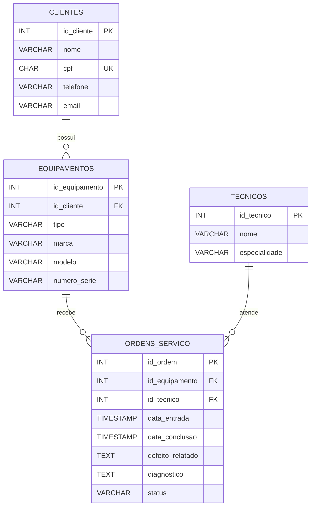

# Diagrama entidade-relacionamento

```mermaid
erDiagram
    CLIENTES ||--o{ EQUIPAMENTOS : possui
    EQUIPAMENTOS ||--o{ ORDENS_SERVICO : recebe
    TECNICOS ||--o{ ORDENS_SERVICO : atende
    CLIENTES {
        INT id_cliente PK
        VARCHAR nome
        CHAR cpf UK
        VARCHAR telefone
        VARCHAR email
    }
    EQUIPAMENTOS {
        INT id_equipamento PK
        INT id_cliente FK
        VARCHAR tipo
        VARCHAR marca
        VARCHAR modelo
        VARCHAR numero_serie
    }
    TECNICOS {
        INT id_tecnico PK
        VARCHAR nome
        VARCHAR especialidade
    }
    ORDENS_SERVICO {
        INT id_ordem PK
        INT id_equipamento FK
        INT id_tecnico FK
        TIMESTAMP data_entrada
        TIMESTAMP data_conclusao
        TEXT defeito_relatado
        TEXT diagnostico
        VARCHAR status
    }
```
